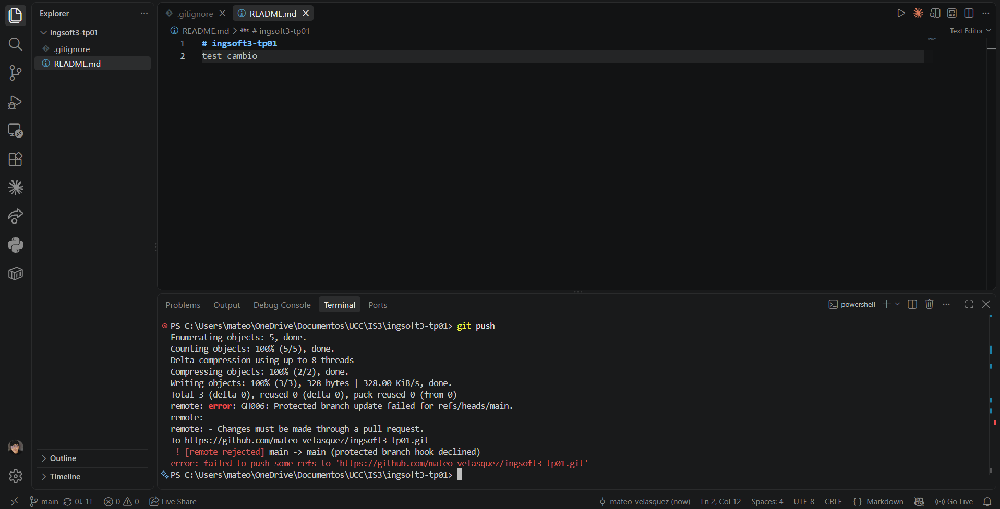
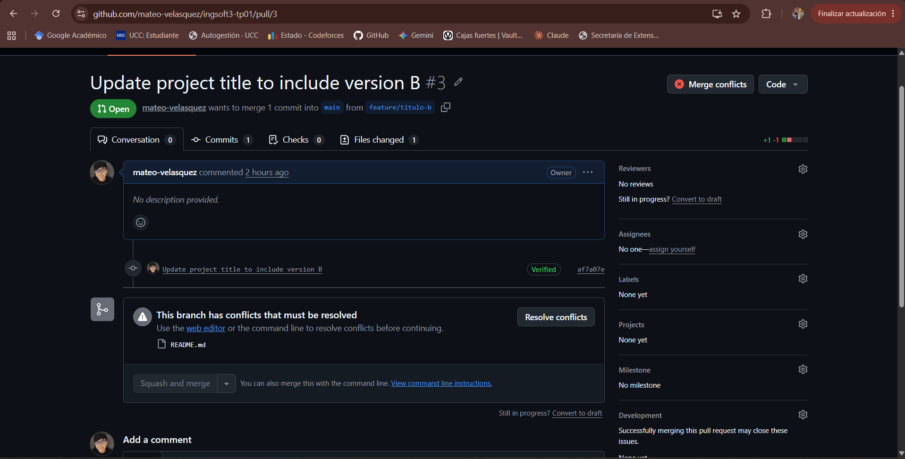
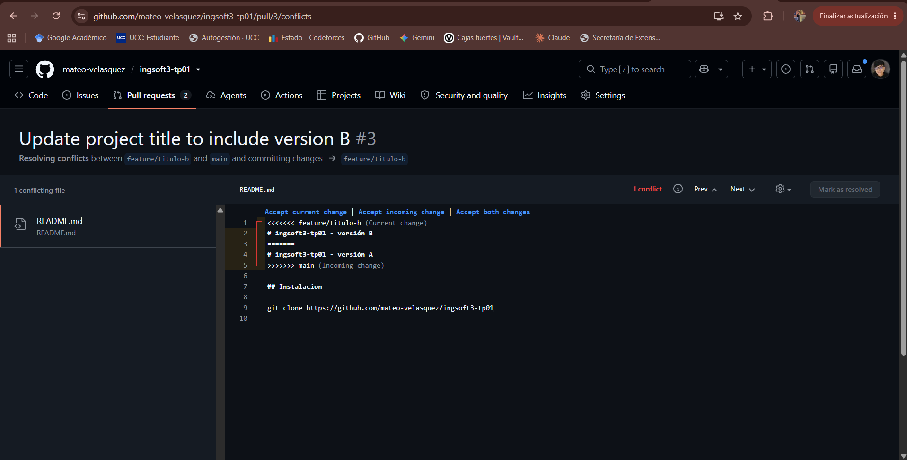
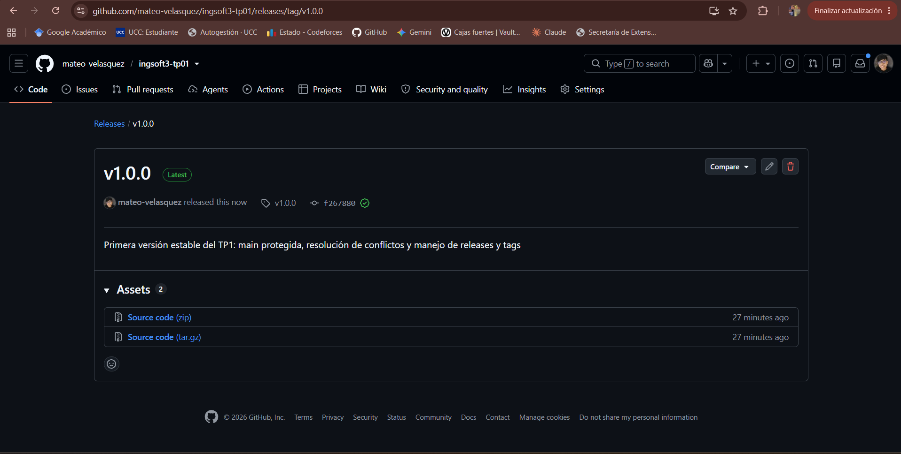

# Evidencias — TP1: Git colaborativo

Repositorio: https://github.com/mateo-velasquez/ingsoft3-tp01

---

## 1. Push directo a `main` rechazado



Intento de `git push` de un commit hecho directamente sobre `main` (`test: intento de push directo`).
GitHub lo rechaza del lado del servidor con `GH006: Protected branch update failed for refs/heads/main`
y el detalle `Changes must be made through a pull request`, terminando en
`! [remote rejected] main -> main (protected branch hook declined)`.

Lo importante es **dónde** falla: el commit local se creó sin problema (Git no impide nada en mi
máquina), pero el remoto lo rechaza al recibirlo. La protección vive en GitHub, no en mi clon. Y me
alcanza a mí, que soy el dueño del repositorio, porque la regla tiene activado *Do not allow
bypassing the above settings*.

---

## 2. El Pull Request no se puede mergear: conflicto detectado



PR **#3** (`feature/titulo-b` → `main`). GitHub muestra el estado **Merge conflicts** y el cartel
*"This branch has conflicts that must be resolved"*, indicando `README.md` como el único archivo en
conflicto. El botón *Squash and merge* queda deshabilitado.

El conflicto aparece porque antes mergeé el PR **#2** (`feature/titulo-a`), que cambió la primera
línea del `README.md`. Las dos ramas salieron del mismo commit de `main` y tocaron esa misma línea.

---

## 3. Los marcadores de conflicto



Editor de resolución de conflictos de GitHub (`/pull/3/conflicts`). Se ven las tres fronteras que
deja Git al no poder decidir:

```
<<<<<<< feature/titulo-b   (Current change)
# ingsoft3-tp01 - versión B
=======
# ingsoft3-tp01 - versión A
>>>>>>> main               (Incoming change)
```

Arriba de `=======` está lo que propone mi rama; abajo, lo que ya está en `main`. El resto del
archivo (la sección `## Instalacion`) **no** está marcado: Git lo fusionó solo, porque ninguna de
las dos ramas lo tocó. El conflicto es quirúrgico, no del archivo entero.

Resolví quedándome con la **versión A** (la que ya estaba integrada en `main`), borré las tres
líneas de marcadores y confirmé con *Mark as resolved* → *Commit merge*.

---

## 4. Release `v1.0.0` publicada



Release `v1.0.0` marcada como *Latest*, asociada al tag `v1.0.0` y apuntando al commit `f267880`
(la punta de `main` después de mergear los tres PRs). Notas: *"Primera versión estable del TP1: main
protegida, resolución de conflictos y manejo de releases y tags"*.

El tag lo creé desde la terminal (`git tag -a v1.0.0` + `git push origin v1.0.0`) y la release la
publiqué desde la web: el tag es el puntero inmutable, la release es la comunicación de qué incluye
esa versión.
